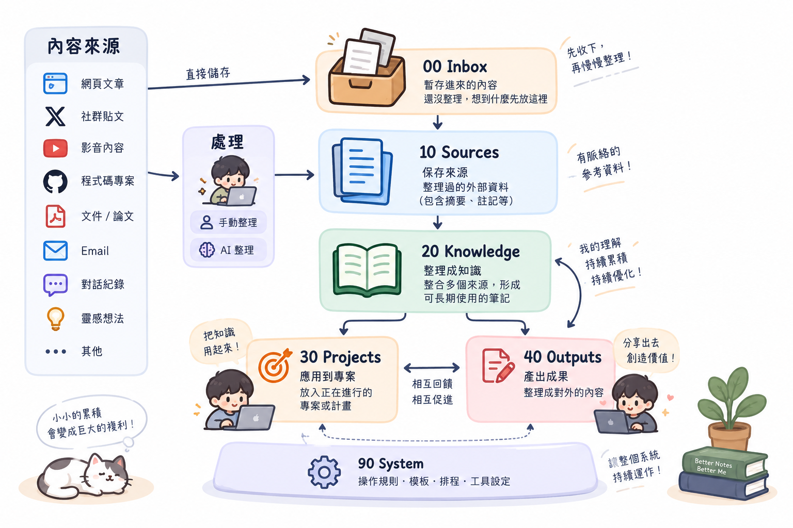

# Second Brain Kit

[繁體中文](./README.zh-TW.md) | English

A collection of reusable AI Agent Skills for building a GitHub-backed, Obsidian-compatible Second Brain that can be shared by humans and AI agents.

The structure comes from a system I use for keeping captured material, external sources, reusable knowledge, project context, and published outputs separate while still allowing them to connect.

## Available Skills

### setup-second-brain

Creates a new GitHub-backed Second Brain, including the folder structure, AGENTS.md, schema, workflows, incremental weekly review, and note templates.

More Skills, such as migration from an existing Second Brain, can be added independently under `skills/`.

## Structure

```text
00 Inbox/
10 Sources/
20 Knowledge/
30 Projects/
40 Outputs/
90 System/
```



- **Inbox** — unprocessed captures.
- **Sources** — external material with provenance.
- **Knowledge** — reusable synthesis built from Sources.
- **Projects** — project-specific context and application.
- **Outputs** — blog posts, social posts, documentation, and other finished material.
- **System** — rules that tell humans and AI agents how to maintain the knowledge base.

## Use it with an AI agent

Install or load this repository as a Skill in an agent that supports Skills, then ask:

> Set up a Second Brain for me using second-brain-kit.

GitHub is the minimum required shared storage. During setup, the agent first resolves the target GitHub repository and verifies that it can read and write the repository directly through an authenticated GitHub integration, MCP server, CLI, or API. If the user does not have a repository yet, the agent should create one when it has that capability, or provide concise creation guidance only when needed. A local Obsidian Vault is optional and can be connected later.

After access is ready, the agent creates the folder structure, `AGENTS.md`, schema, workflows, and maintenance rules in the repository.

You can also point an AI agent directly at this repository and ask it to follow `skills/setup-second-brain/SKILL.md` when setting up a new knowledge base.

## Why GitHub?

The notes remain normal Markdown and can still be opened as an Obsidian Vault. GitHub provides a shared source that can be synchronized across computers and accessed by AI tools that can work with GitHub.

This means the client can change—Obsidian, a coding agent, ChatGPT, or another tool—without creating a separate knowledge silo for each one.

## Incremental maintenance

A Second Brain should not require every Source to be re-read during every review.

Source notes include lifecycle metadata such as `captured`, `reviewed`, and links to Knowledge. A normal weekly review focuses on new or unreviewed Sources, updates the Knowledge they affect, then marks those Sources as reviewed.

Previously reviewed Sources can still be revisited when new evidence materially changes a topic.

## Files

- `skills/setup-second-brain/SKILL.md` — setup and maintenance instructions for AI agents.
- `skills/setup-second-brain/templates/AGENTS.md` — operating rules for the generated Second Brain.
- `skills/setup-second-brain/templates/schema.md` — note metadata and lifecycle.
- `skills/setup-second-brain/templates/workflows.md` — capture, ingestion, output, maintenance, and Git workflows.
- `skills/setup-second-brain/templates/weekly-knowledge-review.md` — incremental Source → Knowledge review.
- `skills/setup-second-brain/templates/source.md` — starter Source note.
- `skills/setup-second-brain/templates/knowledge.md` — starter Knowledge note.

## Philosophy

The goal is not to collect the most notes. The goal is to keep Sources traceable, turn useful material into durable Knowledge, and make that Knowledge available to both people and AI agents.

The structure is intentionally small. Extend it only when your actual workflow requires it.
